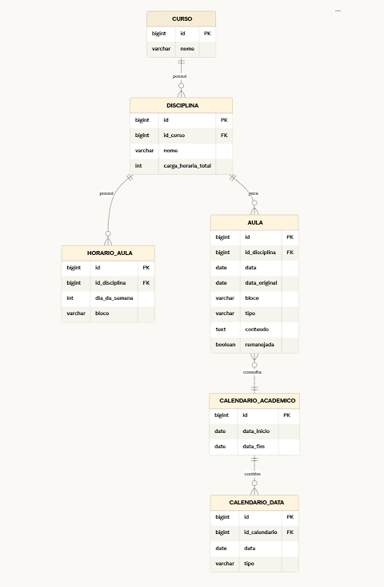

<h1 align="center" style="color: #0080c0;">Sistema de Planejamento de Aulas (SCA)</h1>

<i></i>

<h2 style="color: #0080c0;">🎯 Descrição do Desafio</h2>

O desafio proposto pelo CADI envolve a reformulação da usabilidade no lançamento de planos de aula.
A dor central reside na dificuldade de manter a sincronia entre datas, horários e conteúdos ministrados, especialmente em relação à carga horária mínima e aos feriados

<h2 style="color: #0080c0;">📋 Backlog do Produto</h2>

<table width="100%" style="border-collapse: collapse; background-color: #1e1e1e; color: white; border: 1px solid #333;">
  <tr style="background-color: #2d2d2d; color: #ffffff;">
    <th style="padding: 10px; border: 1px solid #333;">Rank</th>
    <th style="padding: 10px; border: 1px solid #333;">Prioridade</th>
    <th style="padding: 10px; border: 1px solid #333;">User Story</th>
    <th style="padding: 10px; border: 1px solid #333;">Estimativa</th>
    <th style="padding: 10px; border: 1px solid #333;">Sprint</th>
  </tr>
  <tr>
    <td align="center" style="padding: 10px; border: 1px solid #333;">1</td>
    <td align="center" style="padding: 10px; border: 1px solid #333;">Alta</td>
    <td style="padding: 10px; border: 1px solid #333;">Como professor, quero distribuir automaticamente os conteúdos ao longo das aulas do semestre considerando o calendário acadêmico, para reduzir o tempo gasto no planejamento das aulas.</td>
    <td align="center" style="padding: 10px; border: 1px solid #333;">5</td>
    <td align="center" style="padding: 10px; border: 1px solid #333;">1</td>
  </tr>
  <tr>
    <td align="center" style="padding: 10px; border: 1px solid #333;">2</td>
    <td align="center" style="padding: 10px; border: 1px solid #333;">Alta</td>
    <td style="padding: 10px; border: 1px solid #333;">Como professor, quero visualizar em um único lugar todas as aulas da disciplina com suas datas e conteúdos, para planejar o semestre com mais facilidade e evitar erros no planejamento.</td>
    <td align="center" style="padding: 10px; border: 1px solid #333;">8</td>
    <td align="center" style="padding: 10px; border: 1px solid #333;">1</td>
  </tr>
  <tr>
    <td align="center" style="padding: 10px; border: 1px solid #333;">3</td>
    <td align="center" style="padding: 10px; border: 1px solid #333;">Alta</td>
    <td style="padding: 10px; border: 1px solid #333;">Como professor, quero registrar o conteúdo de cada aula, para planejar corretamente os tópicos que serão ensinados ao longo do semestre.</td>
    <td align="center" style="padding: 10px; border: 1px solid #333;">5</td>
    <td align="center" style="padding: 10px; border: 1px solid #333;">1</td>
  </tr>
  <tr>
    <td align="center" style="padding: 10px; border: 1px solid #333;">4</td>
    <td align="center" style="padding: 10px; border: 1px solid #333;">Alta</td>
    <td style="padding: 10px; border: 1px solid #333;">Como professor, quero verificar se a quantidade de aulas planejadas corresponde à carga horária da disciplina, para evitar inconsistências no planejamento.</td>
    <td align="center" style="padding: 10px; border: 1px solid #333;">3</td>
    <td align="center" style="padding: 10px; border: 1px solid #333;">1</td>
  </tr>
  <tr>
    <td align="center" style="padding: 10px; border: 1px solid #333;">5</td>
    <td align="center" style="padding: 10px; border: 1px solid #333;">Alta</td>
    <td style="padding: 10px; border: 1px solid #333;">Como professor, quero editar conteúdos ou datas das aulas planejadas, para ajustar o planejamento quando houver mudanças no calendário ou na disciplina.</td>
    <td align="center" style="padding: 10px; border: 1px solid #333;">13</td>
    <td align="center" style="padding: 10px; border: 1px solid #333;">2</td>
  </tr>
  <tr>
    <td align="center" style="padding: 10px; border: 1px solid #333;">6</td>
    <td align="center" style="padding: 10px; border: 1px solid #333;">Média</td>
    <td style="padding: 10px; border: 1px solid #333;">Como professor, quero planejar minhas aulas considerando automaticamente feriados e eventos acadêmicos, para evitar marcar aulas em datas inválidas.</td>
    <td align="center" style="padding: 10px; border: 1px solid #333;">8</td>
    <td align="center" style="padding: 10px; border: 1px solid #333;">2</td>
  </tr>
  <tr>
    <td align="center" style="padding: 10px; border: 1px solid #333;">7</td>
    <td align="center" style="padding: 10px; border: 1px solid #333;">Média</td>
    <td style="padding: 10px; border: 1px solid #333;">Como coordenador, quero definir os horários das aulas da disciplina, para organizar corretamente as datas das aulas no semestre.</td>
    <td align="center" style="padding: 10px; border: 1px solid #333;">8</td>
    <td align="center" style="padding: 10px; border: 1px solid #333;">2</td>
  </tr>
  <tr>
    <td align="center" style="padding: 10px; border: 1px solid #333;">8</td>
    <td align="center" style="padding: 10px; border: 1px solid #333;">Média</td>
    <td style="padding: 10px; border: 1px solid #333;">Como professor, quero visualizar as datas das aulas junto com os conteúdos planejados, para facilitar a organização do planejamento do semestre.</td>
    <td align="center" style="padding: 10px; border: 1px solid #333;">3</td>
    <td align="center" style="padding: 10px; border: 1px solid #333;">3</td>
  </tr>
  <tr>
    <td align="center" style="padding: 10px; border: 1px solid #333;">9</td>
    <td align="center" style="padding: 10px; border: 1px solid #333;">Baixa</td>
    <td style="padding: 10px; border: 1px solid #333;">Como professor, quero adicionar aulas de reposição em datas disponíveis, para garantir a carga horária mínima da disciplina.</td>
    <td align="center" style="padding: 10px; border: 1px solid #333;">5</td>
    <td align="center" style="padding: 10px; border: 1px solid #333;">3</td>
  </tr>
  <tr>
    <td align="center" style="padding: 10px; border: 1px solid #333;">10</td>
    <td align="center" style="padding: 10px; border: 1px solid #333;">Baixa</td>
    <td style="padding: 10px; border: 1px solid #333;">Como professor, quero visualizar um relatório do planejamento das aulas, para acompanhar e revisar a organização do semestre.</td>
    <td align="center" style="padding: 10px; border: 1px solid #333;">8</td>
    <td align="center" style="padding: 10px; border: 1px solid #333;">3</td>
  </tr>
</table>
<h2 style="color: #0080c0;">📌 Backlog da Sprint 2</h2>

  <b>Sprint 2 Goal/Meta:</b> entregar prioritariamente as User Stories 5 e 6, com foco na edição do planejamento das aulas e na validação automática de feriados e eventos acadêmicos, garantindo mais flexibilidade e consistência no plano de ensino.

  <b>Sprint 2 Extra:</b> a User Story 7 será tratada como escopo adicional da Sprint, podendo ser desenvolvida caso a equipe conclua as entregas prioritárias dentro do prazo previsto.

<table width="100%" style="border-collapse: collapse; background-color: #1e1e1e; color: white; border: 1px solid #333;">
  <tr style="background-color: #2d2d2d; color: #ffffff;">
    <th style="padding: 10px; border: 1px solid #333;">Rank</th>
    <th style="padding: 10px; border: 1px solid #333;">Prioridade</th>
    <th style="padding: 10px; border: 1px solid #333;">User Story</th>
    <th style="padding: 10px; border: 1px solid #333;">Estimativa</th>
    <th style="padding: 10px; border: 1px solid #333;">Sprint</th>
  </tr>
    <td align="center" style="padding: 10px; border: 1px solid #333;">5</td>
    <td align="center" style="padding: 10px; border: 1px solid #333;">Alta</td>
    <td style="padding: 10px; border: 1px solid #333;">Como professor, quero editar conteúdos ou datas das aulas planejadas, para ajustar o planejamento quando houver mudanças no calendário ou na disciplina.</td>
    <td align="center" style="padding: 10px; border: 1px solid #333;">13</td>
    <td align="center" style="padding: 10px; border: 1px solid #333;">2</td>
  </tr>
  <tr>
    <td align="center" style="padding: 10px; border: 1px solid #333;">6</td>
    <td align="center" style="padding: 10px; border: 1px solid #333;">Média</td>
    <td style="padding: 10px; border: 1px solid #333;">Como professor, quero planejar minhas aulas considerando automaticamente feriados e eventos acadêmicos, para evitar marcar aulas em datas inválidas.</td>
    <td align="center" style="padding: 10px; border: 1px solid #333;">8</td>
    <td align="center" style="padding: 10px; border: 1px solid #333;">2</td>
  </tr>
  <tr>
    <td align="center" style="padding: 10px; border: 1px solid #333;">7</td>
    <td align="center" style="padding: 10px; border: 1px solid #333;">Média</td>
    <td style="padding: 10px; border: 1px solid #333;">Como coordenador, quero definir os horários das aulas da disciplina, para organizar corretamente as datas das aulas no semestre.</td>
    <td align="center" style="padding: 10px; border: 1px solid #333;">8</td>
    <td align="center" style="padding: 10px; border: 1px solid #333;">2</td>
  </tr>
</table>
<h2 style="color: #0080c0;">✅ Definition of Ready (DoR) – Sprint 2</h2>

<ul>
  <li>A User Story está escrita no formato <b>Como [participante], quero [ação], para [benefício]</b>.</li>
  <li>O participante está claramente definido.</li>
  <li>As regras de negócio da funcionalidade estão definidas.</li>
  <li>Os dados necessários para a funcionalidade foram identificados.</li>
  <li>As mensagens de confirmação, erro ou aviso foram definidas.</li>
  <li>Existe um esboço da interface da funcionalidade (wireframe ou protótipo).</li>
  <li>A User Story possui prioridade definida no backlog.</li>
  <li>A User Story possui estimativa definida pela equipe.</li>
  <li>A equipe compreende a User Story.</li>
</ul>

<b>Regras de negócio da Sprint 1:</b>

<ul>
  <li>O professor deve poder editar o conteúdo e a data de aulas já planejadas.</li>
  <li>Ao editar a data de uma aula, o sistema deve validar se a nova data é permitida no calendário acadêmico.</li>
  <li>Datas que coincidam com feriados, emendas ou eventos acadêmicos não podem receber aulas.</li>
  <li>O planejamento deve ser reajustado sem perder o vínculo entre aula, conteúdo e disciplina.</li>
  <li>O coordenador deve poder definir os horários e blocos das aulas de cada disciplina.</li>
  <li>Os horários cadastrados devem ser utilizados para organizar corretamente as aulas no semestre.</li>
</ul>

<h2 style="color: #0080c0;">🏁 Definition of Done (DoD) – Sprint 2</h2>

<ul>
  <li>Existe uma interface funcional da funcionalidade.</li>
  <li>A funcionalidade pode ser demonstrada durante a apresentação da Sprint.</li>
  <li>O código foi versionado no GitHub do projeto.</li>
  <li>A documentação da Sprint 2 foi atualizada no repositório.</li>
  <li>Existe um esboço da interface (wireframe ou Figma) associado à User Story.</li>
  <li>A equipe consegue apresentar a solução em formato de pitch de negócio.</li>
  <li>A funcionalidade funciona mesmo sem conexão com banco de dados, podendo utilizar dados em memória.</li>
  <li>Os membros da equipe testaram o projeto.</li>
  <li>A User Story foi revisada pela equipe.</li>
</ul>

## 🏗️ Arquitetura do Sistema (Modelo Lógico)
Para visualizar a estrutura de dados e o relacionamento entre as entidades do sistema, acesse o diagrama completo no link abaixo ou veja a visualização prévia:

<h2 style="color: #0080c0;">🚀 Sprints Realizadas</h2>

<table width="100%" style="border-collapse: collapse; background-color: #1e1e1e; color: white; border: 1px solid #333;">
  <tr style="background-color: #2d2d2d; color: #ffffff;">
    <th style="padding: 10px; border: 1px solid #333;">Período da Sprint</th>
    <th style="padding: 10px; border: 1px solid #333;">Escopo</th>
    <th style="padding: 10px; border: 1px solid #333;">Documentação</th>
    <th style="padding: 10px; border: 1px solid #333;">Incremento (YouTube)</th>
  </tr>
  <tr>
    <td align="center" style="padding: 10px; border: 1px solid #333;">Sprint 1: 16/03 a 05/04</td>
    <td style="padding: 10px; border: 1px solid #333;">User Stories 1, 2, 3 e 4</td>
    <td align="center" style="padding: 10px; border: 1px solid #333;"><a href="docs/sprint1/SPRINT1.md" style="color: #0080c0;">Documentos</a></td>
    <td align="center" style="padding: 10px; border: 1px solid #333;"><a href="https://www.youtube.com/watch?v=6LpdlIZGmns" style="color: #0080c0;">Link Vídeo</a></td>
  </tr>
<tr>
    <td align="center" style="padding: 10px; border: 1px solid #333;">Sprint 2: 13/04 a 03/05</td>
    <td style="padding: 10px; border: 1px solid #333;">User Stories 5, 6 e 7</td>
    <td align="center" style="padding: 10px; border: 1px solid #333;"><a href="docs/sprint2/SPRINT2.md" style="color: #0080c0;">Documentos</a></td>
    <td align="center" style="padding: 10px; border: 1px solid #333;"><a href="" style="color: #0080c0;">Link Vídeo</a></td>
  </tr>
</table>

<h2 style="color: #0080c0;">🛠️ Tecnologias Utilizadas</h2>

  <code>Java</code> | <code>JDBC</code> | <code>PostgreSQL</code> | <code>Maven</code>

<h2 style="color: #0080c0;">📂 Estrutura do Projeto</h2>

<pre style="background-color: #2d2d2d; padding: 10px; border-radius: 5px;">
src/
├── main/
│   ├── java/
│   └── resources/
└── test/
</pre>

<h2 style="color: #0080c0;">⚙️ Como Executar e Testar</h2>

<ol>
  <li>Clone o repositório: <code>git clone [URL]</code></li>
  <li>Configuração: [Descrever passos de ambiente e/ou banco de dados]</li>
  <li>Execução: <code>./mvnw spring-boot:run</code></li>
</ol>

<h2 style="color: #0080c0;">📖 Documentação Adicional</h2>

<table width="100%" style="border-collapse: collapse; background-color: #1e1e1e;">
  <tr>
    <td style="padding: 10px; border: 1px solid #333;"><a href="docs/sprint1/ChecklistDodDor.md" style="color: #0080c0;">Checklist de DoR e DoD</a></td>
    <td style="padding: 10px; border: 1px solid #333;"><a href="docs/sprint1/EstrategiaBranch.md" style="color: #0080c0;">Estratégia de Branch</a></td>
  </tr>
  <tr>
    <td style="padding: 10px; border: 1px solid #333;"><a href="docs/sprint1/ManualUsuario.md" style="color: #0080c0;">Manual do Usuário</a></td>
    <td style="padding: 10px; border: 1px solid #333;"><a href="docs/sprint1/ManualInstalacao.md" style="color: #0080c0;">Manual de Instalação</a></td>
  </tr>
</table>

<h2 style="color: #0080c0;">👥 Equipe</h2>

<table>
  <tr>
    <th>Membro</th>
    <th>Função</th>
    <th>Github</th>
    <th>Linkedin</th>
  </tr>
  <tr>
    <td>André Junqueira</td>
    <td>Desenvolvedor</td>
    <td></td>
    <td></td>
  </tr>
  <tr>
    <td>Gabriel Bastos</td>
    <td>Desenvolvedor</td>
    <td></td>
    <td></td>
  </tr>
  <tr>
    <td>Luiz Eduardo Santos</td>
    <td>Product Owner</td>
    <td></td>
    <td></td>
  </tr>
  <tr>
    <td>Matheus Quirino</td>
    <td>Scrum Master</td>
    <td></td>
    <td></td>
  </tr>
  <tr>
    <td>Rafael Rodrigues</td>
    <td>Desenvolvedor</td>
    <td></td>
    <td></td>
  </tr>
  <tr>
    <td>Thayssa Andrade</td>
    <td>Desenvolvedor(a)</td>
    <td></td>
    <td></td>
  </tr>
</table>

